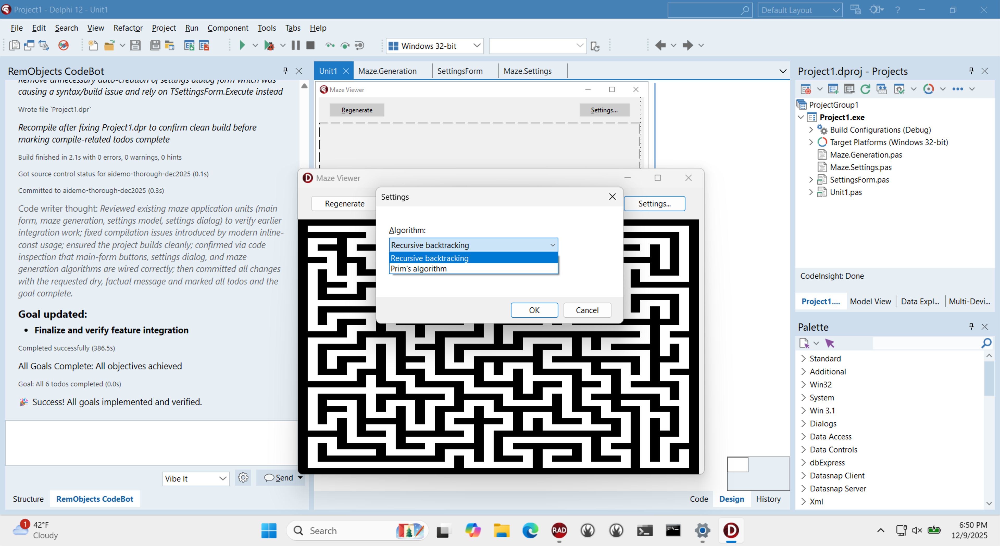

# Demo written by RemObjects CodeBot

This is the repo generated by CodeBot for the Embarcadero CodeRage 2025 webinar. RemObjects CodeBot is a Delphi-oriented AI coding assistant designed specially for Delphi and the Delphi IDE.

CodeBot's prompt (typos included) was:

> Hello. Please make this app display mazes. Add a settings dialog wher ethe user can choose between two maze generaiton algorithms. On the main form add buttons to display settings and to rengerate the maze.

This code was generated in 'Vibe It' mode (no code review), not 'Thorough' mode (higher quality.) You can expect Thorough mode to be better architected, using more interfaces and separated dependencies, etc; you can expect Vibe It mode to be faster.

The app worked first time.

See more about RemObjects CodeBot for Delphi here! https://www.remobjects.com/codebot/delphi.aspx

## Code written by humans

* This readme and screenshot
* Initial commit had a blank new VCL app

## Code written by CodeBot:

* Everything else. The entire app.

Look at the repo history to see how CodeBot created a git feature branch `maze-display-settings`, worked in it, committed. Humans did the merge commit back into `main`.

